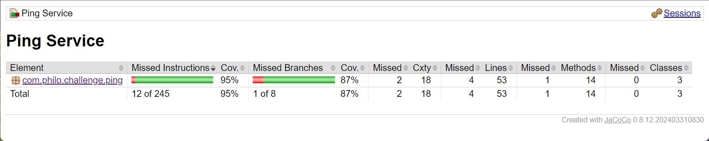
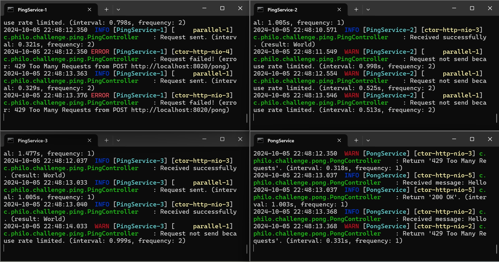

# Code Challenge

**通过根目录的聚合器(`pom.xml`)可以把`ping服务`和`pong服务`同时一起构建——编译代码、执行测试用例、生成覆盖率报告、生成可执行发布包。** *执行命令如下：*
> mvn clean package
- 构建完成后，在`ping/target/site/jacoco`目录和`pong/target/site/jacoco`目录分别生成了测试覆盖率报告。
- 构建完成后，`ping服务`和`pong服务`的可执行发布包分别在`ping/target/ping-0.0.1-SNAPSHOT-bin.zip`路径和`pong/target/pong-0.0.1-SNAPSHOT-bin.zip`路径里。
- 可执行发布包包括了`jar文件`、配置文件(`application.properties`)、Windows环境执行脚本(`start.bat`)、Linux环境执行脚本(`start.sh`、`stop.sh`、`restart.sh`)。
- 如果要多开服务实例，可以在运行启动脚本时指定唯一名称，日志文件也会独立多个实例分别输出到不同文件里。*不同运行环境执行如下：*
  - Windows环境：执行命令`start.bat 1`时，日志文件为`XxxxService-1.log`；执行命令`start.bat 2`时，日志文件为`XxxxService-2.log`
  - Linux环境：执行命令`start.sh 1`时，日志文件为`XxxxService-1.log`和`stdout-1.log`；执行命令`start.sh 2`时，日志文件为`XxxxService-2.log`和`stdout-2.log`

## Ping Service

**配置参数说明**

|         参数          |            说明             |               默认值              |
|:-------------------:|:-------------------------:|:------------------------------:|
|  ping.enabled-send  |   Ping服务启动后，是否立即运行发送任务    |              true              |
|   ping.rate-limit   |   所有Ping服务实例每秒允许发送的请求次数   |                2               |
| ping.pong-base-url  |        Pong服务的基础地址        |      http://localhost:8020     |
| ping.file-lock-path | 多个Ping服务实例并发控制的FileLock路径 | C:\\Users\\philo\\filelock.txt |

## Pong Service

**配置参数说明**

|       参数        |      说明       | 默认值 |
|:---------------:|:-------------:|:---:|
| pong.throttling | 控制每秒允许处理的请求数量 |  1  |

## 部分运行截图

